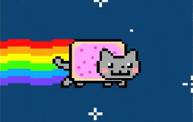
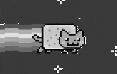
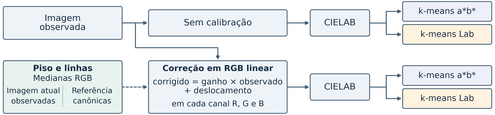
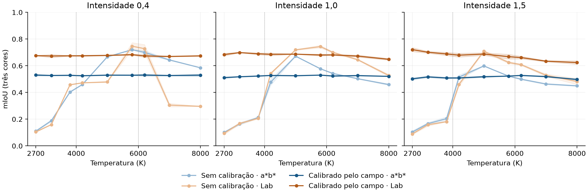
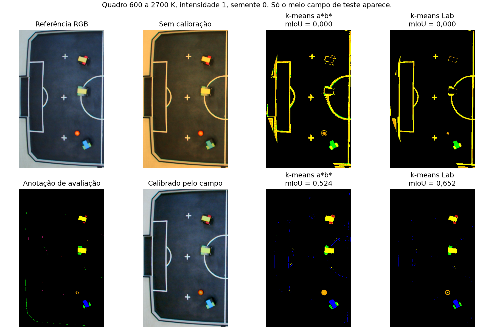

<p>


</p>
<br clear="both">

Código do artigo "Calibração colorimétrica e rotulagem automática por k-means para segmentação semântica sob iluminação não controlada", de Murilo M. Narciso, Maykon Hopka, Marcos R. O. A. Máximo e Sarah N. C. Leite, apresentado no WorCAP 2026 no INPE.

No futebol de robôs VSS a etiqueta colorida de cada robô muda de cor quando a luz muda, e o k-means que separa essas cores erra junto. Aqui a gente testa duas coisas ao mesmo tempo: calibrar a imagem usando o próprio campo, e incluir o L* no agrupamento em vez de usar só o plano a*b* do CIELAB. O que os números mostram é que o L* sozinho quase não ajuda. Ele só passa a valer depois que a cor foi calibrada.

A calibração usa o piso preto e as linhas brancas, que aparecem em toda imagem do campo e não mudam de um jogo pro outro. Na cena de referência medimos a mediana de cada um em RGB linear. Numa imagem nova medimos de novo e resolvemos, canal por canal, o ganho e o deslocamento que levam o piso e a linha observados de volta aos valores da referência. São duas equações e duas incógnitas por canal, sem otimização nenhuma. Pixel com algum canal em 250 ou mais fica fora da mediana, porque pixel saturado não diz nada sobre a luz. A ideia de usar regiões conhecidas do campo pra ajustar a câmera vem de Neves et al. (IbPRIA 2009).



A cena é uma só, o campo de 2020 da ITAndroids com os robôs parados, e a luz é simulada. A referência canônica é a mediana de 200 quadros e o gabarito sai da mediana do vídeo de anotação `dados_2020/videos/mascara.mp4`. Cada imagem de teste recebe um ganho por canal que imita uma temperatura de cor (curva de Kang 2002, relativa a 6500 K) e depois é multiplicada por uma intensidade de 0,4, 1,0 ou 1,5. As temperaturas vão de 2700 K a 8000 K, divididas nas faixas 2700 a 4000, 4000 a 6000 e 6000 a 8000 K, e cada faixa é testada sem ter entrado na escolha de parâmetros.

Essa escolha é feita numa metade do campo, com os quadros 10, 110 e 210 sob as temperaturas centrais das outras duas faixas. A nota sai da outra metade e depois as metades trocam de papel. O limiar de croma e o fator de rejeição dos grupos são os mesmos para os quatro caminhos, e nas seis combinações de faixa e metade deu limiar 24 e fator 0,5. No total são 270 casos (9 temperaturas, 3 intensidades, 5 quadros e os 2 sentidos da troca de metades), cada um rodado com as sementes 0, 1 e 2 nos quatro caminhos, o que dá 3.240 avaliações.

A mIoU é a média do IoU do amarelo, do azul e do vermelho. Sem calibrar, a*b* fica em 0,434 ± 0,001 e Lab em 0,442 ± 0,002. Calibrando pelo campo, a*b* sobe pra 0,522 ± 0,001 e Lab pra 0,677 ± 0,001, com o desvio medido entre as sementes. Incluir L* rende 0,008 sem calibração e 0,155 com ela, de modo que o efeito de um fator depende do outro. No erro de cor, a calibração derruba o ΔE00 médio de 15,31 pra 0,95 nos 647 registros que tinham algum pixel não saturado. Em média 66,2% dos pixels das regiões de referência ficam fora dessa conta por saturação, mas todos voltam no IoU.

Por temperatura e intensidade fica mais claro onde está o ganho. No lado quente as curvas sem calibração desabam e a 2700 K ficam perto de 0,1; com intensidade 0,4 o Lab sem calibração cai também no lado frio, pra 0,3 acima de 7000 K. As calibradas quase não se mexem.



A comparação abaixo é o caso mediano em ΔE00 depois de calibrar, a 2700 K e com a semente 0, e mostra só o meio campo reservado pro teste. Sem calibração a luz quente deixa as linhas brancas amareladas, o k-means rotula as linhas como etiqueta amarela e a mIoU vai a zero nos dois espaços. Calibrada, a mesma imagem dá 0,524 em a*b* e 0,652 em Lab.



Pra rodar, com Python 3.11:

```
pip install -r requirements.txt
python experimento.py
python figuras.py
```

O `worcap.py` tem as funções. O `experimento.py` leva uns sete minutos numa CPU comum, grava `resultados/segmentacao.csv` e `resultados/cor.csv` e imprime no terminal os números do artigo. O `figuras.py` lê esses dois arquivos e refaz as figuras 2 e 3 em `figuras/`. Como os CSVs já estão no repositório, dá pra refazer as figuras sem rodar o experimento. O k-means roda com duas threads fixas, porque com outro número a ordem das somas muda e as últimas casas podem mudar junto. A pasta `dados_2020` tem só os 208 quadros usados e o vídeo de anotação.

Tudo isso vale pra uma cena com luz simulada. Repetir numa cena real sob luz real é o próximo passo.

O gato da direita está em tons de cinza em homenagem ao Shades of Gray de Finlayson e Trezzi (2004). O trabalho teve apoio da CAPES, Código de Financiamento 001, e os dados são da equipe ITAndroids.
